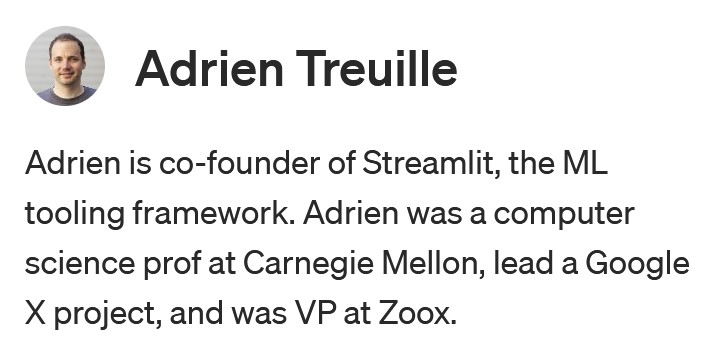

# Introduction

 

## What is [streamlit](https://streamlit.io/) ?

 

Streamlit is an open-source **Python library** that makes it easy to create and share beautiful, custom web apps for **machine learning and data science**. In just a few minutes you can build and deploy powerful data apps

 

### Machine learning and data science code is easy to share but hard to use. GitHub overflows with models, algorithms, and datasets. But code is static. Can you play with the models? See the algorithms? Interact with the data? Doing so requires following complex instructions, installing packages, or reading dense code snippets. Frustrated by this, we decided that we need a simple, sharable “play” button for machine learning code.

 

### **Easily deploy and share your Streamlit apps**

 

## Why do you need another web frame work ?

 

 

* Python based, no need to learn additional technology

* No additional integation required ( Rest APIs) as ML models can be invoked directly

* Getting quick feedback on the model output from the end user(s)

 

## What is a typical use case ?

 

* Quick POC/Demo

* User interaction needed during ML Development

* Stand alone application

 

[Home](./README.md)