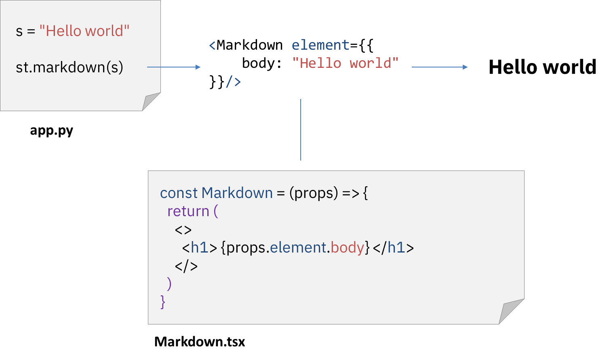

# Under The Hood

 

## STREAMLIT BRIDGES PYTHON AND REACT

 

## Execution

 

### The whole script `app.py` is rerun from top-to-bottom every time the user interacts with it

 

[Example App](./counter_increment_app/app.py)

 

[Home](./README.md)